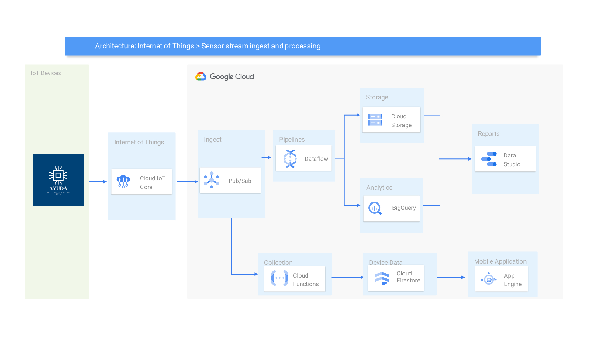

# A.Y.U.D.A
**Protected senior**


# Data Project 2
## Máster en Data Analytics - EDEM
### Curso 2021/2022

- [Ramón Casans Camp](https://www.linkedin.com/in/ramon-casans-camp/)
- [Marta Castillo García](https://www.linkedin.com/in/marta-castillo-garc%C3%ADa-041bb169/)
- [Rafa Pérez Soláns](https://www.linkedin.com/in/rafa-perez-solans/)
- [Mª Ángeles Sanmartin Martinez](https://www.linkedin.com/in/m%C2%AAangeles-sanmart%C3%ADn-mart%C3%ADnez-76b4b9129/)
- [Lluna Sanz Montrull](https://www.linkedin.com/in/llunasmontrull/)

# Proyecto
## Contexto
EDEM ha creado el día 12 de Marzo un evento de lanzamiento de empresas con productos IoT. Es vuestro momento! En este evento podréis presentar vuestro producto IoT como SaaS.
Durante estas tres semanas, debéis pensar un producto IoT, desarrollarlo y simular su uso.
De cara a participar en este evento, la solución debe ser escalable, opensource y cloud.

## ¿Qué es A.Y.U.D.A?
A.Y.U.D.A es una startup enfocada a la protección de la salud. Su primer reto es la asistencia médica y psicológica de los adultos de mayor edad, seguido por el de escalar su solución a bebés y colectivos más vulnerables, a nivel de salud, que puedan necesitalo. Para lograr este desafío, la startup ha lanzado una RFP para monitorizar, en tiempo real, la frecuencia cardiaca, la temperatura corporal, la presión sanguínea y la localización del usuario mediante el uso de parches electrónicos. Estos envían la información a los dispositivos mediante la red LoRa.

Ante cualquier valor anómalo de las métricas especificadas, _Protected Senior_ nuestra app avisará al cuidador, médico o persona responsable. De la misma manera, el dashboard se refrescará en tiempo real.

# Tecnología
## Arquitectura


### Justificación
Se emplea la herramienta de _Pub/Sub_ por ser el servicio de mensajería de Google Cloud que permite intercambiar datos de eventos, así como comunicarse asíncronamente. Además, facilita la conexión de los mensajes con el resto de servicios de la plataforma.

Por las características del proyecto, que será vendido tanto a clientes como empresas, _Pub/Sub_ tendrá un topic conectado a la herramienta de análisis de los datos (almacenados en _Cloud Storage_) _BigQuery_ y otro topic conectado a _Cloud Functions_.

Para el uso por parte de los clientes (B2C), el procesamiento de datos será realizado en _Cloud Functions_, el servicio de procesamiento de datos en la nube tanto para batch como tiempo real. Entonces, la herramienta se levanta para el envío de la notificación a las personas responsables cuando se detecta un dato anómalo. Por ese motivo, se utiliza _Cloud Functions_ y no _Dataflow_, implantando el _pay-as-you-go_, abaratando costes. Por la parte de almacenamiento de datos, se utiliza _Cloud Firestore_, la base de datos más reciente de _Firebase_ optimizada para el desarrollo de apps de dispositivos móviles. Aprovecha la mejor parte de _Realtime Database_ con un modelo de datos nuevo y más intuitivo. Con dicho servicio, se pueden realizar consultas más ricas y rápidas, además de un escalamiento que se ajusta a un nivel más alto que _Realtime Database_.

Por otra parte, para la venta a las empresas (B2B), se considera el uso de _Dataflow_ puesto que se permitiría la monitorización de las constantes vitales en tiempo real y visualizarlas en un dashboard de _Data Studio_.

## Setup (parte 1)
### Iniciar servicios en Google Cloud
```
gcloud services enable dataflow.googleapis.com
gcloud services enable cloudiot.googleapis.com
gcloud services enable cloudbuild.googleapis.com
```

### Crear entorno de Python e instalar las dependencias
```
virtualenv -p python3 device
source device/bin/activate
```
```
pip install -U -r setup_dependencies.txt
```

### Pub/Sub
Se crean dos temas en Pub/Sub:
- iotToBigQuery
- users\_data

### IoT Core
En [IoT Core](https://console.cloud.google.com/iot) se  crea el registro _deviceRegistry_. Luego, se genera una clave RSA con el estándar X.509 ejecutando el siguiente comando, dentro de la carpeta <em>01_IoTCore></em> en la consola de comandos:
```
openssl req -x509 -nodes -newkey rsa:2048 -keyout rsa\_private.pem
  \ -out rsa\_cert.pem -subj "/CN=unused"
```
Con la clave obtenida, se crea el dispositivo dentro del registro _deviceRegistry_ con el nombre _ayuDevice_ que simulará las medidas del dispositivo de A.Y.U.D.A se accede a la pestaña de _autenticación_ del registro creado y se agrega la clave pública generada en el apartado _comunicación, cloud logging y autenticación_.

### Cloud Storage
Se crea un nuevo bucket con el nombre que mejor se considere (en este caso, _el-bucket-definitiu_) con la opción de región preferida.

### BigQuery
En la página de [BigQuery](https://console.cloud.google.com/bigquery), se crea un dataset con el que se trabajará. En este proyecto, se tratará del llamado _pleaseDataset_.

## Setup (parte 2)
### Base de datos Firestore
Se crea un proyecto en [firebase](https://firebase.google.com) y se conecta al Id del proyecto especificado anteriormente. De esta manera se vincula Firebase a Cloud. Una vez ya está vinculado, se activa la base de datos Firestore en modo nativo.

### Cloud Functions
Para insertar los datos generados en la base de datos, se creará una funcion en _Cloud Functions_ que, cada vez que reciba un mensaje nuevo desde _Pub/Sub_, lo guardará en la base datos.

En la página de [Cloud Functions](https://console.cloud.google.com/functions), se crea una función con un activador que sea Cloud Pub/Sub y, en específico, el tema especificado en _ayudaDeviceToFirestore.py_. Al ejecutarse el device con los comandos en la consola, cada vez que el Pub/Sub reciba un nuevo mensaje, la función lo enviara a la base de datos de FireStore.


## Ejecución del pipeline
En la consola, se accede a la carpeta <em>02_Dataflow</em> y se ejecutan los siguientes comandos:

```
gcloud builds submit --tag 'gcr.io/data-project-2-ayuda/dataflow/device:latest' .
gcloud dataflow flex-template build "gs://el-bucket-definitiu/dataflowtemplate.json" \
  --image "gcr.io/data-project-2-ayuda/dataflow/device:latest" \
  --sdk-language "PYTHON" 
gcloud dataflow flex-template run "device-dataflow-job" \
    --template-file-gcs-location "gs://el-bucket-definitiu/dataflowtemplate.json" \
    --region "europe-west1"
```
Una vez se han ejecutado exitosamente los comandos, se accede a la carpeta <em>01_IoTCore</em> y ejecutamos el siguiente para iniciar el script del dispositivo IoT:
```
python DeviceData.py \
    --algorithm RS256 \
    --cloud_region europe-west1 \
    --device_id ayuDevice \
    --private_key_file rsa_private.pem \
    --project_id data-project-2-ayuda \
    --registry_id  deviceRegistry
```

# Demo
[](https://www.youtube.com/watch?v=J-ISejCfPTA)

#Presentación
https://www.canva.com/design/DAE4355MSDw/zcYwW03sAG1DpTkPFhPDPQ/view?utm_content=DAE4355MSDw&utm_campaign=designshare&utm_medium=link&utm_source=publishsharelink
